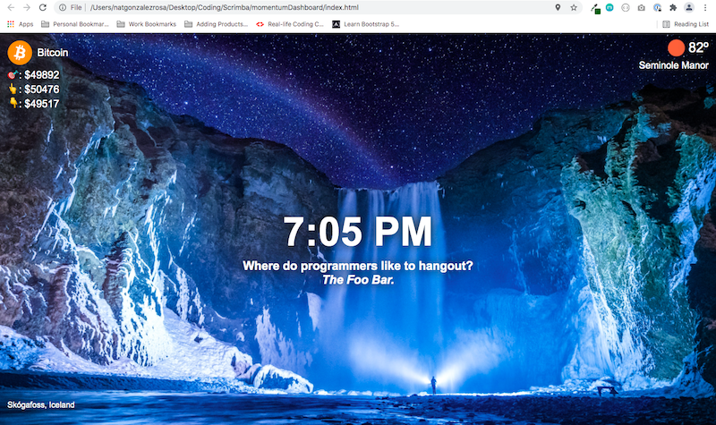

# Instructions
You can download the file, save locally and upload as a Chrome extension to your computer.

## Steps to Add as a Chrome Extension
1. Download code and unzip to desktop
2. Open the browser and go to chrome://extensions/
3. Turn Developer mode on
4. Click the **Load unpacked** button and select the folder that the dashboard files are in
5. Open a new tab and the Momentem dashboard clone extension should work!

## APIs used
* [Weather API from OpenWeatherMap](https://openweathermap.org/api): for weather data
* [Unsplash API](https://unsplash.com/developers): for background image and location data
* [Coingecko API](https://www.coingecko.com/api/documentations/v3): for cryptocurrency data
* [Official Joke API](https://github.com/15Dkatz/official_joke_api): for random programmer jokes data
* [Geolocation API](https://developer.mozilla.org/en-US/docs/Web/API/Geolocation_API): to obtain user's current location

## Screenshot Sample
